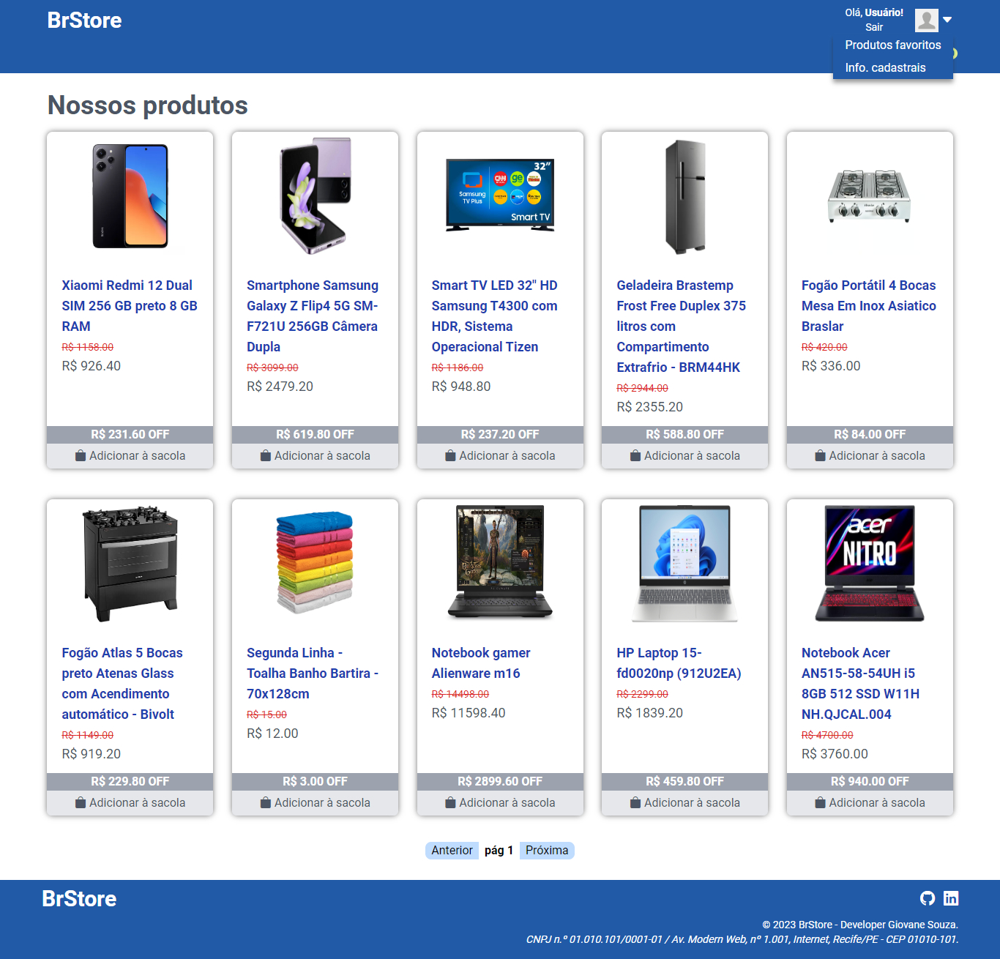

# Atividade 3

## Como executar o projeto?

- [x] Necessário ter o Node, Git e uma IDE instalados na sua máquina;
- [x] Clone o repositório e acesse a branch `3-atividade-3` (**comandos abaixo**);

#### Clonando o repositório:
```shell
git clone https://github.com/giovanesouza/react-entregas-italents.git
```
#### Mudando de branch:
```shell
git checkout 3-atividade-3
```


- [x] Entre na pasta **brStore**: `cd brStore` e, em seguida, baixe as dependências do projeto por meio do comando `npm i`;
- [x] Por fim, execute o programa por meio do comando `npm start`. 
A aplicação 'rodará' no endereço [http://localhost:3000](http://localhost:3000).


## Atividade 3: Desenvolver uma aplicação que contenha os seguintes tópicos.

- No mínimo 2 páginas;
- Página de autenticação;
- Utilização de useContext, UseState e UseEffect;
- Rotas privadas;
- Integração com Api.


## Resultados obtidos

### Página inicial da aplicação


### Listagem de produto por categoria (Ex.: Categoria dos eletrônicos)


### Exibição de produto buscado


### Página de cadastro de usuários


### Página de Login


### Usuário logado - alteração do menu e permissões


### Página de produtos favoritos


### Página de Checkout


### Página de rota inexistente


