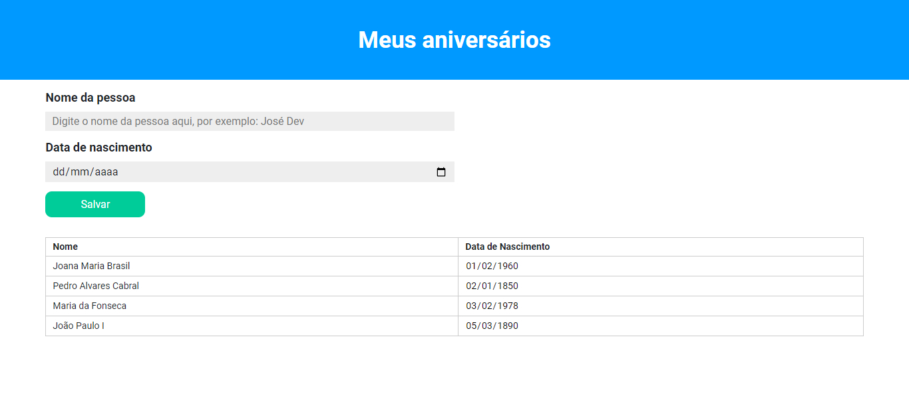

# react-entregas-italents

## Como executar o projeto?

- [x] Necessário ter o Node, Git e uma IDE instalados na sua máquina;
- [x] Clone o repositório (comando abaixo) e acesse a branch `1-atv1`;

#### Clonando o repositório:
```shell
git clone https://github.com/giovanesouza/react-entregas-italents.git
```
#### Mudando de branch:
```shell
git checkout 1-atv1
```


- [x] Entre na pasta **birthdays**: `cd birthdays` e, em seguida, baixe as dependências do projeto por meio do comando `npm i`;
- [x] Por fim, execute o programa por meio do comando `npm start`. 
A aplicação 'rodará' no endereço [http://localhost:3000](http://localhost:3000).


## Atividade 1: Desenvolver uma aplicação que contenha os seguintes tópicos.

- Desenvolver um projeto com no mínimo 3 componentes;
- Troca de dados via propriedades;
- Um dos componentes deve utilizar o atributo children;
- Estilização em todos componentes;
- Uso de useState para gerenciamento e exibição das variáveis de estado.

## Resultado obtido

")

