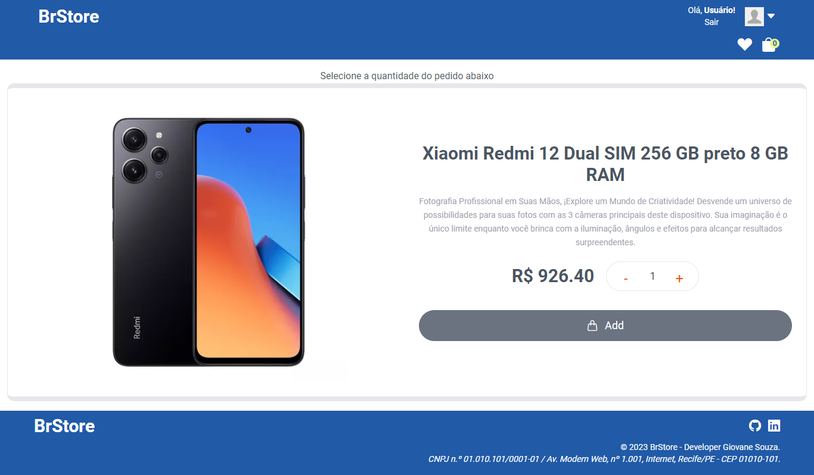
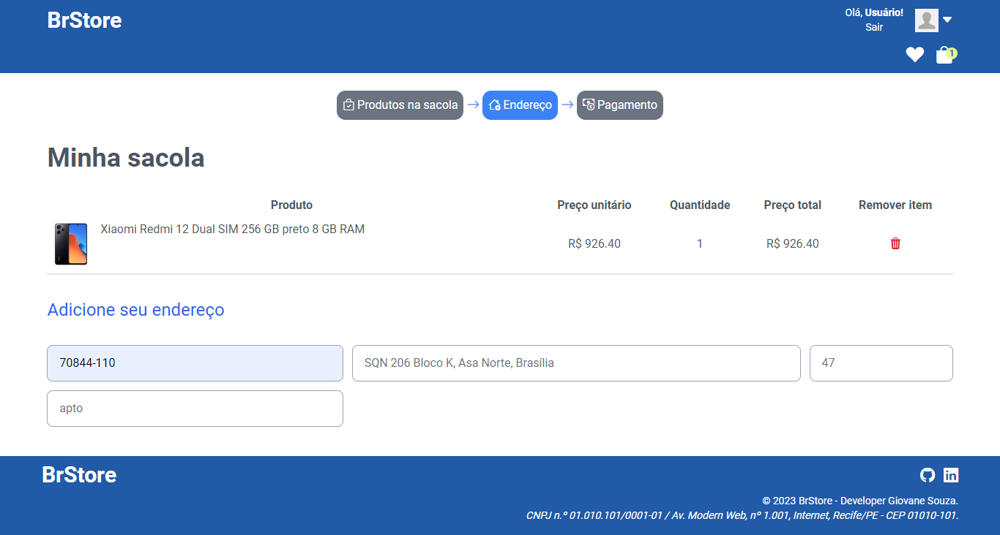
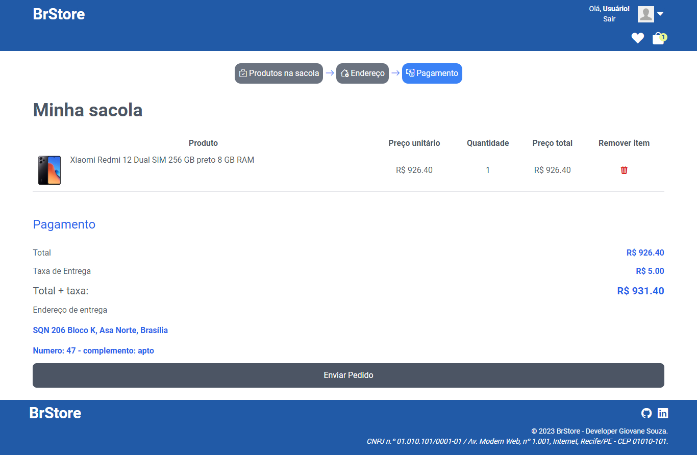
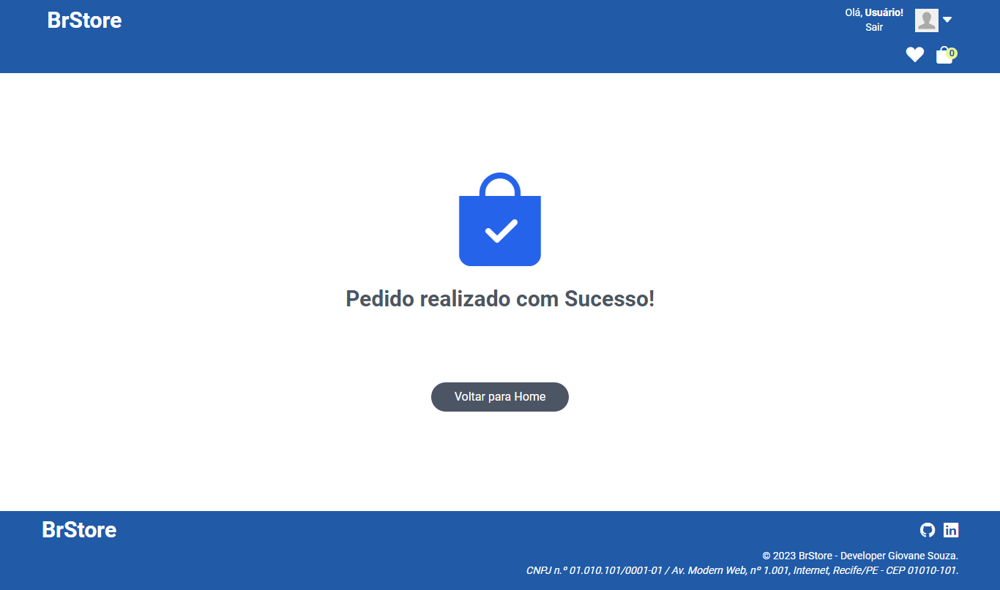
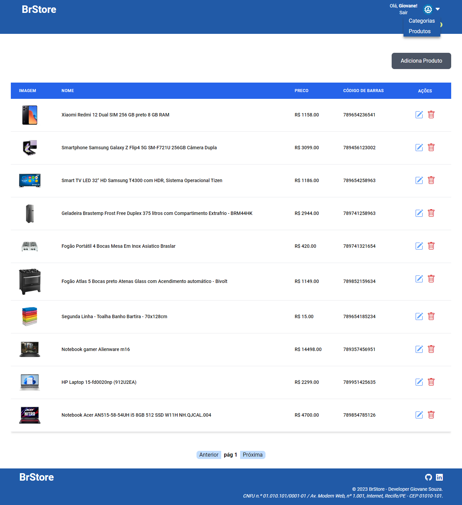
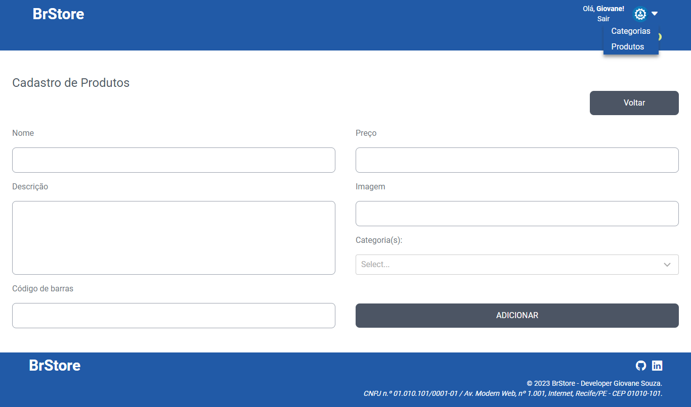
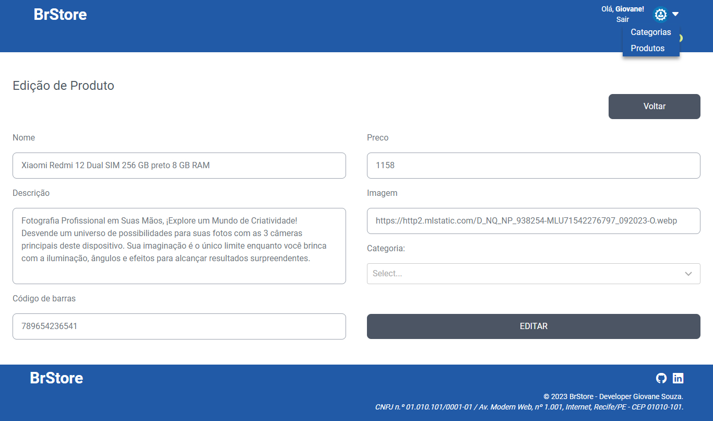
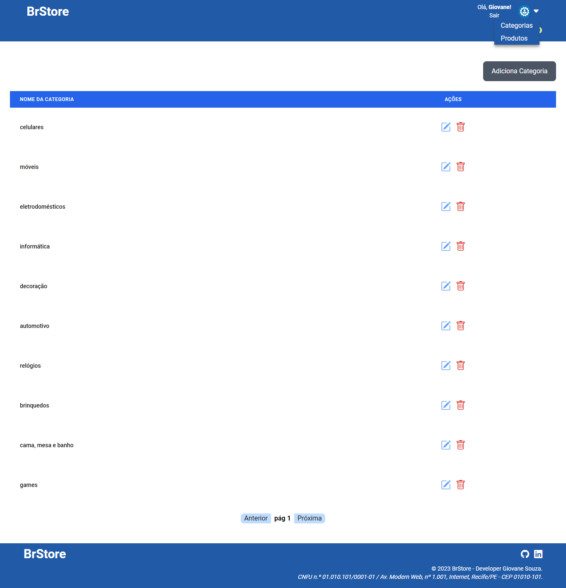
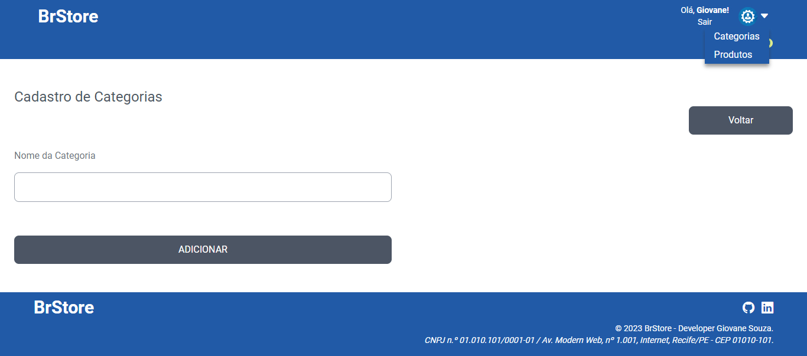
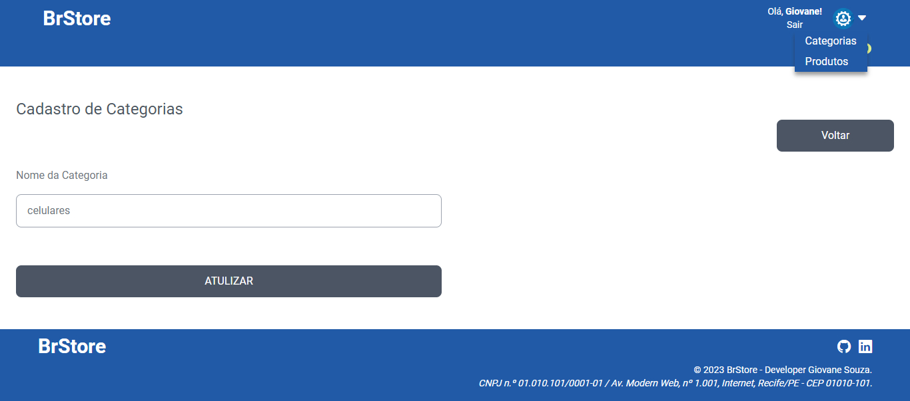

# Atividade 4

> Projeto completo

## Como executar o projeto?

- [x] Necessário ter o Node, Git e uma IDE instalados na sua máquina;
- [x] Clone o repositório e acesse a branch `4-atividade-4` (**comandos abaixo**);

#### Clonando o repositório:
```shell
git clone https://github.com/giovanesouza/react-entregas-italents.git
```
#### Mudando de branch:
```shell
git checkout 4-atividade-4
```


- [x] Entre na pasta **brStore**: `cd brStore` e, em seguida, baixe as dependências do projeto por meio do comando `npm i`;
- [x] Por fim, execute o programa por meio do comando `npm start`. 
A aplicação 'rodará' no endereço [http://localhost:3000](http://localhost:3000).


## Atividade 4: Desenvolver uma aplicação que contenha os seguintes tópicos.

- No mínimo 5 páginas
- Autenticação + rotas seguras
- CRUD completo (Criação, Leitura, Exclusão e Edição)
- Troca de dados entre rotas via props
- Troca de estados globais com useContext 
- Estilização de todas as páginas com tawindcss
- Integração com serviço externo via axios consumindo endpoints [GET/POST/PUT/DELETE]


## Resultados obtidos

### Página inicial da aplicação (público geral e cliente)


### Página de cadastro de usuários


### Página de Login


### Usuário logado - alteração do menu e permissões (Cliente)
")

### Página de produtos favoritos


### Página de informações cadastrais (usuário - somente leitura)
")

### Página de Checkout (sem produtos add)
")


### Página de add produto ao carrinho


### Página de add produto ao carrinho com produto adicionado


### Carrinho - pagamento


### Mensagem de finalização de pedido



## ADMIN

### Produtos cadastrados


### Cadastro de Produtos


### Atualização de produto


### Categorias cadastradas


### Cadastro de categorias


### Atualização de categoria



### Página de rota inexistente


