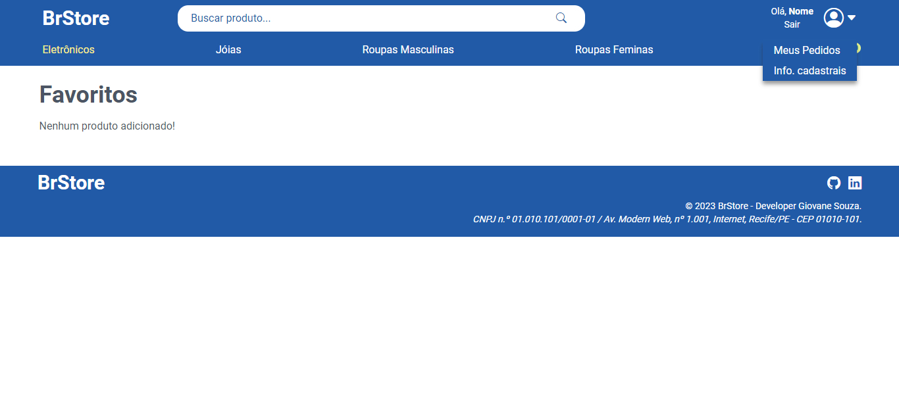

# react-entregas-italents

## Como executar o projeto?

- [x] Necessário ter o Node, Git e uma IDE instalados na sua máquina;
- [x] Clone o repositório (**comando abaixo**) e acesse a branch `2-atividade-2`;

#### Clonando o repositório:
```shell
git clone https://github.com/giovanesouza/react-entregas-italents.git
```
#### Mudando de branch:
```shell
git checkout 2-atividade-2
```


- [x] Entre na pasta **brStore**: `cd brStore` e, em seguida, baixe as dependências do projeto por meio do comando `npm i`;
- [x] Por fim, execute o programa por meio do comando `npm start`. 
A aplicação 'rodará' no endereço [http://localhost:3000](http://localhost:3000).


## Atividade 1: Desenvolver uma aplicação que contenha os seguintes tópicos.

- Desenvolver uma aplicação com no mínimo 4 páginas;
- Envio de dados via rotas através de parâmetros;
- Página de erro 404 para rotas não encontradas;
- Todas as páginas estilizadas;


## Resultados obtidos

### Página inicial da aplicação


### Listagem de produto por categoria (Ex.: Categoria dos eletrônicos)


### Exibição de produto buscado


### Página de cadastro de usuários


### Página de Login


### Página de produtos favoritos


### Página de Checkout


### Página de rota inexistente


